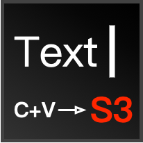

<p align="center">
  
</p>

# 粘贴并上传

[](https://marketplace.visualstudio.com/items?itemName=duanyll.paste-s3) [](https://open-vsx.org/extension/duanyll/paste-s3) [](https://github.com/latel/vscode-paste-s3)

此扩展允许您直接从剪贴板（或通过文件）粘贴图像（及其他文件系统文件），将其上传到 S3（或 S3 兼容端点）存储桶，然后插入指向该图像（文件）的链接。它利用 `DocumentPaste` 和 `DocumentDrop` API，并支持在远程工作区中使用。此扩展还支持 S3 兼容存储的 `forcePathStyle`。

## 功能特性

- 使用 VS Code API 从剪贴板获取图片，即使在远程工作区也可以使用。无需额外的快捷键，只需按 `Ctrl+V` 即可粘贴图片！
  
- 或者从文件浏览器或浏览器拖放图片
  
- 可按语言覆盖的代码片段，用于插入链接（内置支持 Markdown 和 LaTeX）
- 将图片上传到任何 S3 兼容存储（不限于 AWS S3，例如阿里云 OSS、Cloudflare R2 等）
- 或将图片保存到工作区（支持虚拟工作区，如 [Overleaf Workshop](https://marketplace.visualstudio.com/items?itemName=iamhyc.overleaf-workshop)）
  
- 智能缓存，避免重复上传相同文件（基于内容哈希）

## 系统要求

需要 VS Code 1.97 或更高版本。不需要外部依赖项，适用于所有平台和远程工作区。

## 扩展设置

如果您想将图片上传到 S3，则需要配置 S3 设置。您可以在用户设置（或工作区设置）中进行配置，如下所示：

```jsonc
{
  "paste-s3.s3.region": "oss-cn-hongkong",
  // 如果您不使用 AWS S3，需要设置端点
  "paste-s3.s3.endpoint": "https://oss-cn-hongkong.aliyuncs.com",
  "paste-s3.s3.accessKeyId": "YourAccessKeyId",
  "paste-s3.s3.secretAccessKey": "YourSecretAccessKey",
  "paste-s3.s3.bucket": "your-bucket-name",
  // 将添加到 S3 对象键的前缀（斜杠将被保留）
  "paste-s3.s3.prefix": "img/",
  // 将添加到插入链接的前缀（斜杠将被保留）
  "paste-s3.s3.publicUrlBase": "https://cdn.duanyll.com/img/",
  // 强制使用路径样式 URL，适用于 S3 兼容存储（如 MinIO）
  "paste-s3.s3.forcePathStyle": true
}
```

建议在用户设置中配置 S3 凭据，以避免泄露。配置 S3 相关选项后，您可以按 `Ctrl+Shift+P` 并搜索 `粘贴并上传: 测试 S3 连接` 来验证您的设置。

所有设置都可以通过工作区设置覆盖。直接属于 `paste-s3` 部分的设置可以通过特定语言的设置覆盖。例如，以下配置将为 Markdown 和 LaTeX 启用 paste-s3，并将 Markdown 的图片上传到 S3，将 LaTeX 的图片保存到工作区：

```jsonc
{
  "paste-s3.enabled": false,
  // 保存为 ${workspaceFolder}/figures/image.png
  "paste-s3.workspace.path": "figures",
  // 插入 \includegraphics{image.png}（如果您有 \graphicspath{figures}）
  "paste-s3.workspace.linkBase": "",
  "[markdown]": {
    "paste-s3.enabled": true,
    "paste-s3.uploadDestination": "s3"
  },
  "[latex]": {
    "paste-s3.enabled": true,
    "paste-s3.uploadDestination": "workspace"
  }
}
```

完整的设置列表可以在 VS Code 设置界面中找到（搜索 `粘贴并上传`）。以下是一些值得注意的设置：

| 名称                                    | 描述                               | 默认值     | Markdown 默认值                     |
| --------------------------------------- | ---------------------------------- | ---------- | ----------------------------------- |
| `paste-s3.enabled`              | 启用或禁用扩展                     | `true`     |                                     |
| `paste-s3.uploadDestination`    | 图片上传的目标位置                 | `s3`       |                                     |
| `paste-s3.fileNamingMethod`     | 如何命名上传的文件                 | `md5short` |                                     |
| `paste-s3.defaultSnippet`       | 要插入的默认代码片段               | `$url`     | `[${1:$TM_SELECTED_TEXT}](${url})`  |
| `paste-s3.imageSnippet`         | 图片的代码片段                     | `$url`     | `` |
| `paste-s3.mimeTypeFilter`       | 通过 MIME 类型过滤粘贴文件的正则表达式 | `""`       |                                     |
| `paste-s3.ignoreWorkspaceFiles` | 忽略工作区中已有的文件             | `true`     |                                     |

此扩展使用原生 VS Code API 来粘贴图片，请同时参考 VS Code 设置中的 `粘贴为` 和 `拖放` 部分，以控制粘贴和拖放文件的行为，以及此扩展的优先级。

## 已知问题

通过按 `Ctrl+Z` 撤销粘贴操作可以还原工作区中的更改，但图片不会从 S3 中删除。这是 VS Code API 的限制。我们通过添加 `粘贴并上传: 撤销最近的上传` 命令提供了一个解决方法，该命令将显示最近上传的列表，并允许您手动选择和删除它们。


## 发布说明

### 0.1.0

paste-s3 的初始版本。

### 0.2.0

- 更多设置文档
- 添加首次运行通知

## 致谢

图标来自 Nitish Khagwal 的 [PureSugar Icons](https://dribbble.com/shots/6689165-Pure-Sugar-60-Free-SVG-Icons-Pack-Sketch-Vector-Icon-Freebie)。
